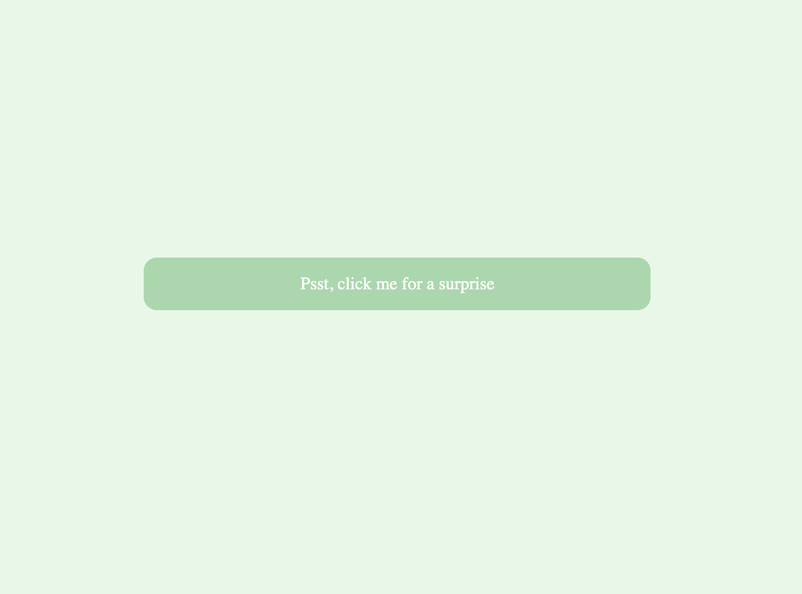
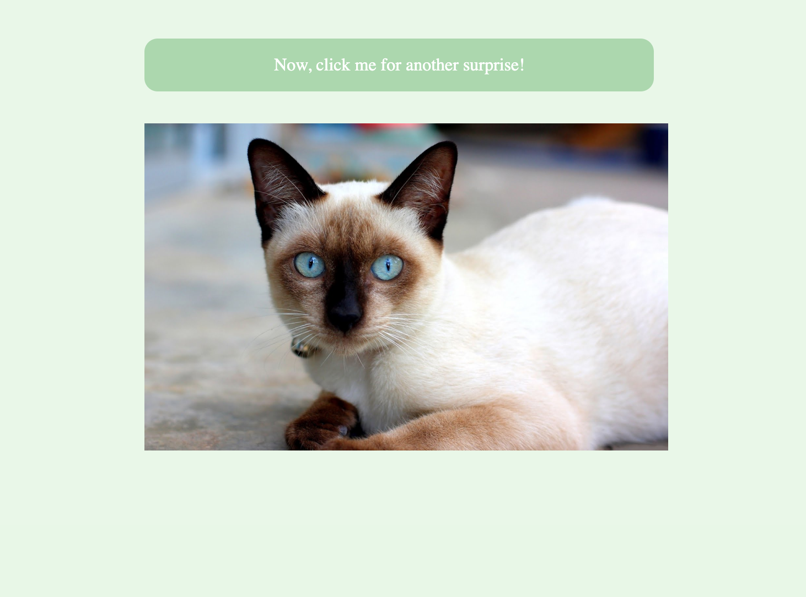

# Kitty Surprise

This is a web app that shows some very basic use of [The Cat API](https://thecatapi.com/). 

With the click of a button, your mood will instantly be lifted! 

---

# Installation

To start, clone this repository to your machine and run **Bundle**

Boot up localhost by using the **Rails Server** command, and open localhost:3000 in your browser of choice. 

